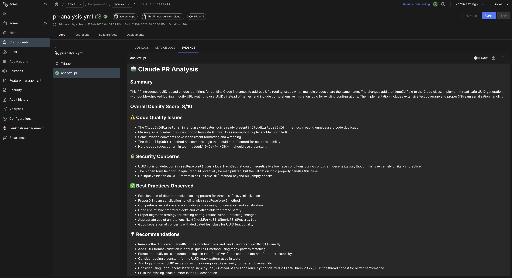
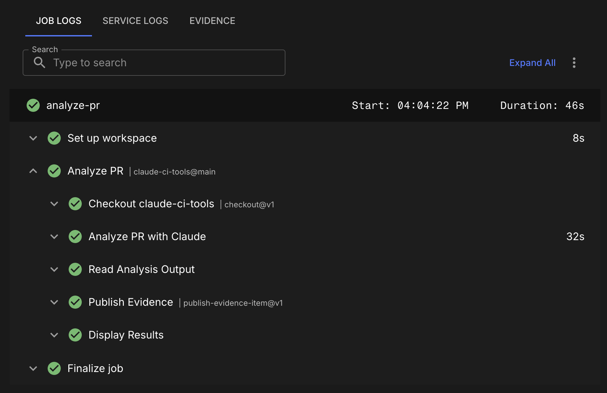

# Claude CI Tools

> **Automated PR code review using Claude AI** - Get instant feedback on code quality, security, and best practices directly in your CloudBees workflows.

[](https://github.com/swashbuck1r/claude-ci-tools)
[](https://opensource.org/licenses/MIT)

**✨ Add to your CloudBees workflow in 5 minutes** | [View on GitHub](https://github.com/swashbuck1r/claude-ci-tools)

## Table of Contents

- [Using in CloudBees Workflows](#using-in-cloudbees-workflows)
  - [Quick Setup](#quick-setup)
  - [Required Secrets](#required-secrets)
  - [What It Does](#what-it-does)
  - [Viewing Results](#viewing-results)
  - [Advanced Options](#advanced-options)
- [Action Inputs & Outputs](#action-inputs--outputs)
- [Local Testing](#local-testing)
- [Additional Resources](#additional-resources)

## Using in CloudBees Workflows

### Quick Setup

Add this workflow to your repository at `.cloudbees/workflows/pr-analysis.yml`:

```yaml
apiVersion: automation.cloudbees.io/v1alpha1
kind: workflow
name: PR Analysis with Claude

on:
  pull_request:
    types:
      - opened
      - synchronize
      - reopened

jobs:
  analyze-pr:
    steps:
      - name: Analyze PR
        uses: swashbuck1r/claude-ci-tools@main
        with:
          anthropic-api-key: ${{ secrets.ANTHROPIC_API_KEY }}
          github-token: ${{ secrets.GITHUB_TOKEN }}
          pr-number: ${{ cloudbees.event.pull_request.number }}
          repository: ${{ cloudbees.scm.repository }}
          post-comment: "true"
```

### Required Secrets

Add these secrets to your CloudBees organization:

1. **ANTHROPIC_API_KEY** - Get from https://console.anthropic.com/
   - Go to Organization Settings → Secrets
   - Add new secret: `ANTHROPIC_API_KEY`

2. **GITHUB_TOKEN** - GitHub Personal Access Token
   - Create at: https://github.com/settings/tokens
   - Required scopes: `repo` (or `public_repo` for public repos only)
   - Add as secret: `GITHUB_TOKEN`

### What It Does

When a pull request is opened or updated, Claude automatically:

- Analyzes all changed files and code diffs
- Reviews code quality and identifies issues
- Checks for security vulnerabilities
- Evaluates adherence to best practices
- Provides actionable recommendations
- Assigns an overall quality score (1-10)

### Viewing Results

**Evidence Tab** - Analysis is published to the Evidence tab for easy review:



**Workflow Steps** - See the analysis in action:



The analysis includes:

- 🤖 Summary of changes
- ⭐ Quality score (1-10)
- ⚠️ Code quality issues
- 🔒 Security concerns
- ✅ Best practices observed
- 💡 Recommendations

### Advanced Options

#### Quality Gate

Fail the build if code quality is below a threshold:

```yaml
jobs:
  analyze-pr:
    steps:
      - name: Analyze PR
        id: analysis
        uses: swashbuck1r/claude-ci-tools@main
        with:
          anthropic-api-key: ${{ secrets.ANTHROPIC_API_KEY }}
          github-token: ${{ secrets.GITHUB_TOKEN }}
          pr-number: ${{ cloudbees.event.pull_request.number }}
          repository: ${{ cloudbees.scm.repository }}
          post-comment: "true"

      - name: Check Quality Gate
        uses: docker://alpine:3.20
        shell: sh
        if: ${{ steps.analysis.outputs.quality-score < 7 }}
        run: |
          echo "⚠️ Quality score below threshold: ${{ steps.analysis.outputs.quality-score }}/10"
          exit 1
```

#### Manual Trigger

Create an on-demand workflow at `.cloudbees/workflows/manual-pr-analysis.yml`:

```yaml
apiVersion: automation.cloudbees.io/v1alpha1
kind: workflow
name: Manual PR Analysis

on:
  workflow_dispatch:
    inputs:
      pr-number:
        description: "PR number to analyze"
        required: true
        type: number

jobs:
  analyze:
    steps:
      - name: Analyze PR
        uses: swashbuck1r/claude-ci-tools@main
        with:
          anthropic-api-key: ${{ secrets.ANTHROPIC_API_KEY }}
          github-token: ${{ secrets.GITHUB_TOKEN }}
          pr-number: ${{ inputs.pr-number }}
          repository: ${{ cloudbees.scm.repository }}
          post-comment: "true"
```

See [CloudBees Usage Guide](docs/CLOUDBEES_USAGE.md) for more examples and patterns.

---

## Action Inputs & Outputs

### Inputs

| Input               | Required | Description                                  | Default                       |
| ------------------- | -------- | -------------------------------------------- | ----------------------------- |
| `anthropic-api-key` | Yes      | Anthropic API key for Claude                 | -                             |
| `github-token`      | Yes      | GitHub token for API access                  | -                             |
| `pr-number`         | Yes      | Pull request number to analyze               | -                             |
| `repository`        | Yes      | Repository in format `owner/repo`            | -                             |
| `post-comment`      | No       | Post analysis as PR comment (`true`/`false`) | `false`                       |
| `tools-repository`  | No       | Override claude-ci-tools repository location | `swashbuck1r/claude-ci-tools` |

### Outputs

| Output             | Description                         |
| ------------------ | ----------------------------------- |
| `analysis-summary` | One-line summary of the PR analysis |
| `quality-score`    | Overall quality score from 1-10     |

**Example using outputs:**

```yaml
steps:
  - name: Analyze PR
    id: analysis
    uses: swashbuck1r/claude-ci-tools@main
    with:
      anthropic-api-key: ${{ secrets.ANTHROPIC_API_KEY }}
      github-token: ${{ secrets.GITHUB_TOKEN }}
      pr-number: ${{ cloudbees.event.pull_request.number }}
      repository: ${{ cloudbees.scm.repository }}

  - name: Use outputs
    run: |
      echo "Summary: ${{ steps.analysis.outputs.analysis-summary }}"
      echo "Score: ${{ steps.analysis.outputs.quality-score }}/10"
```

---

## Local Testing

### Quick Start (Local Testing)

### 1. Clone and Install

```bash
git clone <your-repo-url>
cd claude-ci-tools
pip install -r requirements.txt
```

### 2. Get API Keys

- **Anthropic API Key**: Get from https://console.anthropic.com/
- **GitHub Token**: Create at https://github.com/settings/tokens (needs `repo` scope)

### 3. Configure Environment

```bash
# Copy the example environment file
cp .env.example .env
```

Edit `.env` with your settings:

```env
ANTHROPIC_API_KEY=sk-ant-xxxxx
GITHUB_TOKEN=ghp_xxxxx

TEST_REPO_OWNER=owner
TEST_REPO_NAME=repo
TEST_PR_NUMBER=123
```

### 4. Run Analysis

```bash
python -m claude_ci_tools.test_local
```

You should see Claude analyze the PR and output a detailed code review!

---

## AWS Bedrock Alternative

If you have AWS Bedrock access and want to use it instead of the Anthropic API (e.g., for local development with existing AWS credentials), see the **[Bedrock Setup Guide](docs/BEDROCK_SETUP.md)** for configuration details.

---

## Features

- ✅ **CloudBees Action** - Drop-in workflow for CloudBees CI/CD
- 🤖 **Powered by Claude Sonnet 4** - Advanced AI code review
- 📊 **Evidence Integration** - Results published to CloudBees Evidence tab
- 🔍 **Comprehensive Analysis** - Code quality, security, best practices
- 💬 **PR Comments** - Optional automatic comments on pull requests
- ⭐ **Quality Scoring** - Actionable 1-10 quality scores with gates

## Environment Variables Reference

### Local Testing (Anthropic API)

| Variable            | Required | Description                  |
| ------------------- | -------- | ---------------------------- |
| `ANTHROPIC_API_KEY` | Yes      | Your Anthropic API key       |
| `GITHUB_TOKEN`      | Yes      | GitHub Personal Access Token |
| `TEST_REPO_OWNER`   | Yes      | Repository owner             |
| `TEST_REPO_NAME`    | Yes      | Repository name              |
| `TEST_PR_NUMBER`    | Yes      | Pull request number          |

### Local Testing (AWS Bedrock)

See [Bedrock Setup Guide](docs/BEDROCK_SETUP.md) for Bedrock-specific variables.

---

## Output

The analysis includes:

- **Summary**: Brief overview of the changes
- **Overall Quality Score**: 1-10 rating
- **Code Quality Issues**: Identified problems in code quality
- **Security Concerns**: Potential security vulnerabilities
- **Best Practices**: Positive observations
- **Recommendations**: Suggestions for improvement

### Example Output

```markdown
# 🤖 Claude PR Analysis

## Summary

This PR adds user authentication functionality with JWT tokens and includes
proper error handling throughout the authentication flow.

## Overall Quality Score: 8/10

## ⚠️ Code Quality Issues

- Password validation could be more robust with additional complexity requirements
- Missing input sanitization in the login endpoint for special characters

## 🔒 Security Concerns

- JWT secret should be stored in environment variables, not hardcoded
- Consider adding rate limiting to prevent brute force attacks

## ✅ Best Practices Observed

- Proper error handling with specific error messages
- Clean separation of concerns between routes and authentication logic
- Good use of password hashing with bcrypt

## 💡 Recommendations

- Add rate limiting to authentication endpoints using a library like Flask-Limiter
- Consider implementing refresh token functionality for better security
- Add logging for failed authentication attempts for security monitoring
```

## How It Works

1. **Fetches PR data** - Gets files, diffs, and metadata from GitHub
2. **Sends to Claude** - Analyzes changes using Claude Sonnet 4 via Bedrock or Anthropic API
3. **Structured analysis** - Returns code quality issues, security concerns, best practices, and recommendations
4. **Outputs results** - Displays in console, Evidence tab, and optionally as PR comments

## Additional Resources

- **[CloudBees Usage Guide](docs/CLOUDBEES_USAGE.md)** - Detailed examples and patterns
- **[Bedrock Setup Guide](docs/BEDROCK_SETUP.md)** - AWS Bedrock configuration for local testing
- **[Example Workflows](.cloudbees/workflows/)** - Complete workflow examples

## How It Works

1. **Checkout** - Clones the claude-ci-tools repository
2. **Fetch PR Data** - Uses GitHub API to get changed files and diffs
3. **Analyze with Claude** - Sends code changes to Claude Sonnet 4 for review
4. **Parse Results** - Extracts quality issues, security concerns, and recommendations
5. **Publish Evidence** - Saves analysis to CloudBees Evidence tab
6. **Output Results** - Displays in console and optionally posts PR comment

## Contributing

Issues and pull requests welcome at https://github.com/swashbuck1r/claude-ci-tools

## License

MIT
